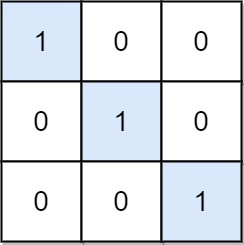

# 1582. Special Positions in a Binary Matrix

Given an m x n binary matrix mat, return the number of special positions in mat.

A position (i, j) is called special if mat[i][j] == 1 and all other elements in row i and column j are 0 (rows and
columns are 0-indexed).

## Example 1:

> Input: mat = [[1,0,0],[0,0,1],[1,0,0]] 
> Output: 1 
> Explanation: (1, 2) is a special position because mat[1][2] == 1 and all other elements in row 1 and column 2 are
> 0. 

## Example 2:

> Input: mat = [[1,0,0],[0,1,0],[0,0,1]]  
> Output: 3 
> Explanation: (0, 0), (1, 1) and (2, 2) are special positions. 

## Constraints:

- m == mat.length
- n == mat[i].length
- 1 <= m, n <= 100
- mat[i][j] is either 0 or 1.
